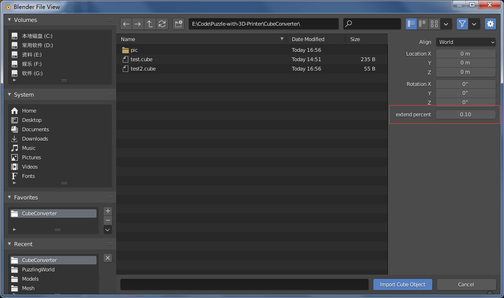
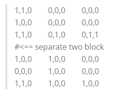
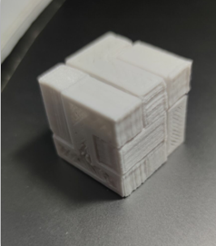
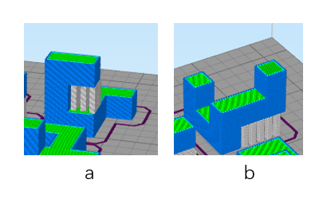
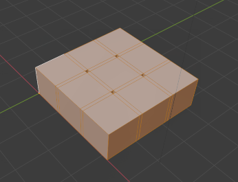

# Cube Converter - Blender Add-on

It's a cubic converter for a specific case, the 3D printer.

## Why

When I'm trying to print a cube-based structure for my puzzle collection,  the material will extend a little and it can't fit.

So I'm trying to find a better way, for efficiently generating such structure as well as solving the unfit problem.

## How to use

### install

This is a standard Blender Add-On, supporting blender later than 2.80.

About how to install it, you can refer to the official manual.

https://docs.blender.org/manual/en/latest/advanced/scripting/addon_tutorial.html

### Run

- Choose the correct .cube file [format is defined in following section]
- Choose the extend percentage. It is related to your 3D printer performance and actual print size. You may need to test it several times.

### .cube file

This is a type I defined for cube structure input.

Separator is '#', \n', '\t' & ','

Example,

That's the result for the above .cube.

## Result

The result within the Blender.

Actual printed-out result.

## Note

I'm not an expert with 3D print, but I found for the following case, the hinge is much easier to remove in fig b than fig a. You may want to use this property to optimize the layout.

## Further

- Interactive .cube file generation

- Fix the hole

